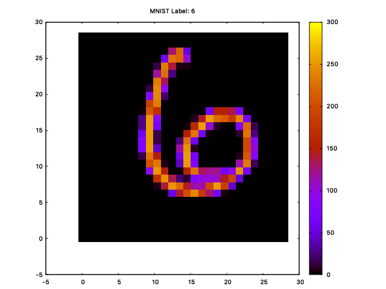

# MNIST Parser for Rust 

A simple, fast, and safe Rust crate for parsing the [MNIST dataset](https://yann.lecun.org/exdb/mnist/index.html) of handwritten digits.

This library provides a clean API for reading the original IDX file format, a robust Image struct for data manipulation, and an optional feature for easy visualization with gnuplot.

## Features

* Correct & Safe: Parses the IDX file format according to the official specification.
* Ergonomic API: Provides a simple Image struct with helpful methods (as_u8_array, as_f32_array, as_f64_array, etc.).
* Expressive Errors: Uses a custom MnistError enum for precise, programmatic error handling.
* ASCII Visualization: Implements the Display trait on Image for quick terminal-based viewing.
* Optional Plotting: Includes a plotting feature flag that enables graphical display of images via gnuplot.
* Lightweight: Has zero dependencies by default. gnuplot is only included when the plotting feature is enabled.

## Getting Started
Follow these steps to get the data and run the included demo application.

### 1. Clone the Repository

```bash
git clone https://github.com/jesper-olsen/mnist-rust.git
cd mnist-rust
```
### 2. Download the MNIST Dataset

The original download links on Yann LeCun's website are often unavailable. The recommended way to get the data is from the TensorFlow/Keras datasets mirror.

Create a directory for the data and download the four files into it:

```bash
mkdir MNIST

curl -o MNIST/train-images-idx3-ubyte.gz https://storage.googleapis.com/tensorflow/tf-keras-datasets/train-images-idx3-ubyte.gz
curl -o MNIST/train-labels-idx1-ubyte.gz https://storage.googleapis.com/tensorflow/tf-keras-datasets/train-labels-idx1-ubyte.gz
curl -o MNIST/t10k-images-idx3-ubyte.gz https://storage.googleapis.com/tensorflow/tf-keras-datasets/t10k-images-idx3-ubyte.gz
curl -o MNIST/t10k-labels-idx1-ubyte.gz https://storage.googleapis.com/tensorflow/tf-keras-datasets/t10k-labels-idx1-ubyte.gz
```

Optional - download [Fashion MNIST](https://www.kaggle.com/datasets/zalando-research/fashionmnist) also (same format):
```
mkdir MNISTfashion
curl -o MNISTfashion/train-images-idx3-ubyte.gz http://fashion-mnist.s3-website.eu-central-1.amazonaws.com/train-images-idx3-ubyte.gz
curl -o MNISTfashion/train-labels-idx1-ubyte.gz http://fashion-mnist.s3-website.eu-central-1.amazonaws.com/train-labels-idx1-ubyte.gz
curl -o MNISTfashion/t10k-images-idx3-ubyte.gz http://fashion-mnist.s3-website.eu-central-1.amazonaws.com/t10k-images-idx3-ubyte.gz
curl -o MNISTfashion/t10k-labels-idx1-ubyte.gz http://fashion-mnist.s3-website.eu-central-1.amazonaws.com/t10k-labels-idx1-ubyte.gz
```
Next, decompress the files:

``` bash
gunzip MNIST/*.gz
```

Your MNIST directory should now contain the four uncompressed data files.

### 3. Run the Demo Application
The repository includes a demo binary that uses this library to display images.

To show an image as ASCII art in the terminal:
(This command displays image #2 from the training set)

```bash
cargo run -- --data-dir MNIST/ --image-number 2
```

Example output:
```text
--- Dataset: train | Image #2 | Label: 4 ---

                    .@
    ..              :*
    :*              :@
    @*              @*
    @*             *@:
    @*             *@.
   :@*             @@
   *@:            *@@
   *@.          .*@@.
   *@.     :::@@@*@@
   :@@@@@@@@@*:.  @@
    :*****..     .@@
                 *@:
                 *@.
                 *@.
                 *@.
                 *@.
                 *@:
                 *@:
                 .@:
```

To show an image in a graphical plot with gnuplot:
(This command displays image #100 from the test set)

First, ensure you have gnuplot installed on your system. Then, run the demo with the plotting feature and the --plot flag:

``` bash
cargo run --features plotting -- --data-dir MNIST/ --dataset test --image-number 100 --plot
```



## Library Usage

To use this crate in your own project, add it to your Cargo.toml:

``` toml
[dependencies]
mnist = { git = "https://github.com/jesper-olsen/mnist-rs.git" }
```

You can then use it to load the data:

```rust
use mnist::{Mnist, MnistError};

fn main() -> Result<(), MnistError> {
    let data = Mnist::load("MNIST");

    println!("Loaded {} training labels and {} images.", data.train_labels.len(), data.train_images.len());

    // Get the first image and its label
    let first_image = &data.train_images[0];
    let first_label = data.train_labels[0];

    println!("--- First Image (Label: {first_label}) ---");
    // Print the image as ASCII art
    println!("{first_image}");

    // Get the image data as a normalized f64 slice
    let pixel_data: [f64; 784] = first_image.as_f64_array();
    // Use pixel_data for your machine learning model...

    Ok(())
}
```

## Demo Application Command-Line Options

The demo binary provides several options to explore the dataset.

```bash
# Get help on all available options
cargo run -- --help
```
``` text
A demo application to showcase the mnist-parser library

Usage: main [OPTIONS] --data-dir <DATA_DIR>

Options:
  -d, --data-dir <DATA_DIR>          Path to the directory containing the MNIST dataset files
  -i, --image-number <IMAGE_NUMBER>  Image number to show [default: 0]
      --dataset <DATASET>            Train/Test set [default: train]
      --plot                         Display the images using gnuplot (requires plotting feature)
  -h, --help                         Print help
  -V, --version                      Print version
```

## Cargo Feature Flags
plotting: Enables the plot() function, which depends on the gnuplot crate. This feature is disabled by default to keep the dependency tree minimal.

## License
This project is licensed under the MIT License. See the LICENSE file for details.

## Acknowledgments
Yann LeCun, Corinna Cortes, and Christopher J.C. Burges for creating and curating the MNIST dataset.
